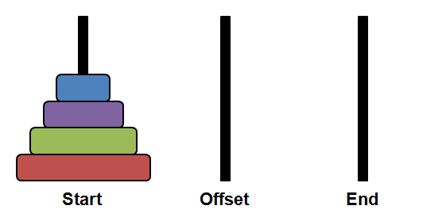
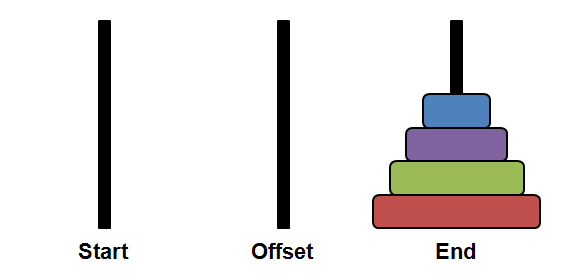

# Tower Of Hanoi

It is believed to be unsolvable problem

There is story behind this problem, it is believed that somewhere in the world there is a temple
and there is a tower with sixteen golden disk
and few priests are trying to move disc from tower to tower and they are doing it from centuries
and if they are successful, the world will end (doomsday) **omegalul**

But this problem can be solved using recursion

Goal 
- Transfer all disc from tower A to C

Condition
- Can only move one disc at a time
- Larger disc cannot be kept over a smaller disc
- Tower B for auxiliary only, the last destination should be tower C
